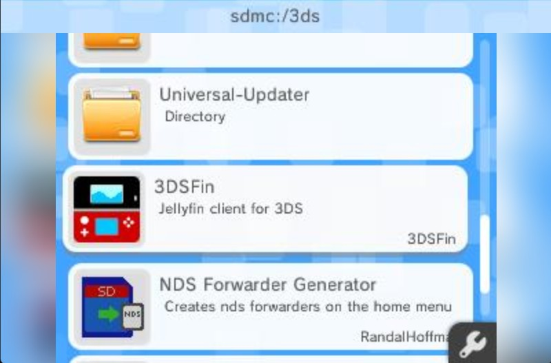

# 3DSFin
**Video and audio playback of your entire jellyfin catalog, on your new 3ds!**

3DSfin is a *work in progress* jellyfin client for New Nintendo 3DS. 


## Install 
 ### Prerequisites
  - [devkitPro](https://devkitpro.org/wiki/Getting_Started) with the `3ds-dev` group installed
  - [MakeRom](https://github.com/3DSGuy/Project_CTR/releases/tag/makerom-v0.18.3) installed in `~\devkitPro\tools\bin` for .cia build

  ### Build

  **Linux / macOS**
  ```bash
  export DEVKITPRO=/opt/devkitpro
  export DEVKITARM=/opt/devkitpro/devkitARM
  export PATH=$DEVKITARM/bin:$DEVKITPRO/tools/bin:$PATH
  make
```

  **Windows (PowerShell)**
  ```
  $env:DEVKITPRO = "C:/devkitPro"
  $env:DEVKITARM = "C:/devkitPro/devkitARM"
  $env:PATH = "C:\devkitPro\msys2\usr\bin;C:\devkitPro\devkitARM\bin;C:\devkitPro\tools\bin;$env:PATH"
  C:\devkitPro\msys2\usr\bin\make.exe

  Output: 3dsfin.3dsx
  ```

## Setup
After moving `3dsfin.3dsx` to 3DS, launch homebrew to find application:

Login with server IP and user credentials:

Connection will start:

Full Library Catalog can be browsed:

Browsing Within Library:

Playback:


## Current Status
3DSfin is in very early development. 3DSfin suports the following features:
- Video Playback and Audio Playback of your jellyfin library.
- Server Adding: Enter your jellyfin server URL via the on-screen keyboard
- Full Library Browsing: Scrollable list of all your Jellyfin Libraries. Browse
- Metadata Viwe: Displays title, year, duration, and media type
- Stream URL retrieval: Requests a server-transcoded H.264/AAC MPEG-TS stream at 400×240 (240p) and 1.5 Mbps
- Persistent config — Server URL and username are saved to /3ds/3dsfin/config.ini on the SD card between sessions


## Credits
- thanks to [FourthTube](https://github.com/erievs/FourthTube), for figuring out streaming logic and audio sync issues
