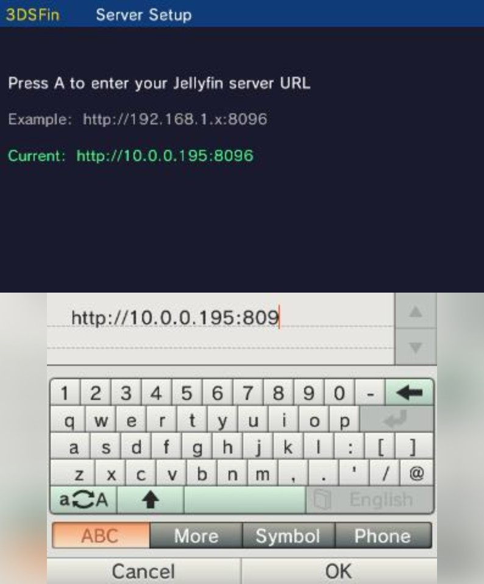
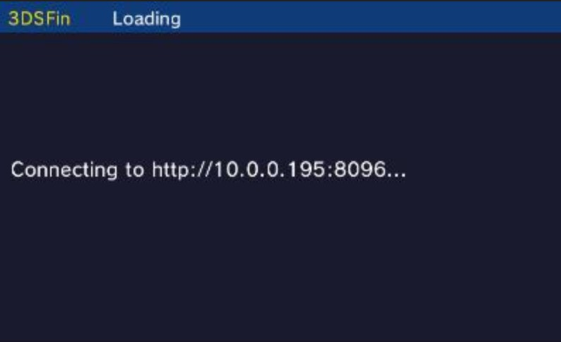
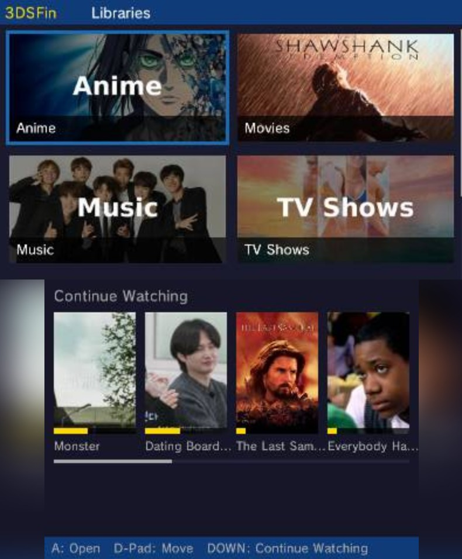
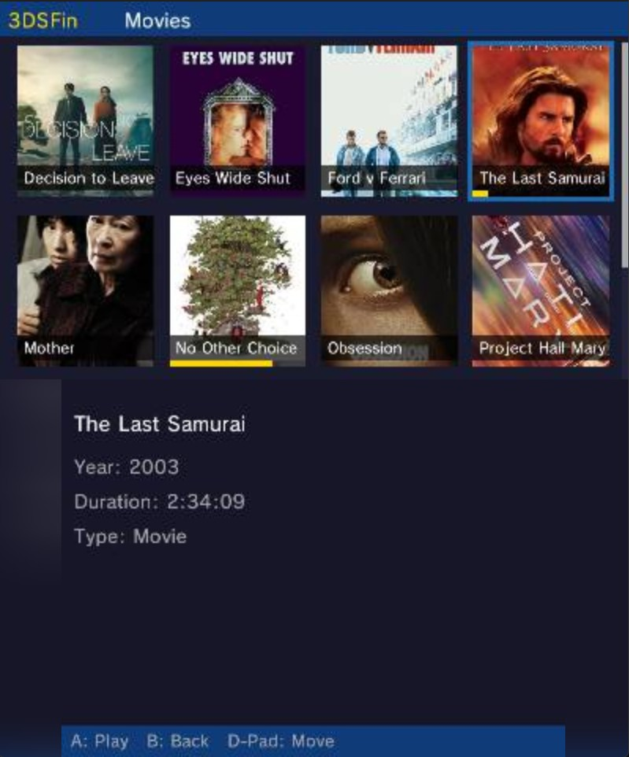
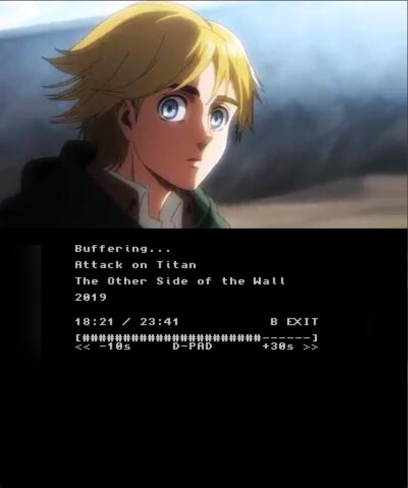

# 3DSFin
Video playback of your entire jellyfin catalog, on your New 3ds!
3DSfin is a *work in progress* jellyfin client for New Nintendo 3DS. 

[](https://github.com/arechawla/3DSfin/releases) 

*NOTE:* .cia does **not** work as of now. Use .3dsx and launch from homebrew for working version.

## Install 


 ### 1. Manual Install
 Donwload from releases tab and place onto 3ds sd card, launch from homebrew 

 ### 3. Build From Source:

 #### Prerequisites
  - [devkitPro](https://devkitpro.org/wiki/Getting_Started) with the `3ds-dev` group installed
  - [MakeRom](https://github.com/3DSGuy/Project_CTR/releases/tag/makerom-v0.18.3) installed in `~\devkitPro\tools\bin` for .cia build

  #### Build

  **Linux / macOS**
  ```bash
  export DEVKITPRO=/opt/devkitpro
  export DEVKITARM=/opt/devkitpro/devkitARM
  export PATH=$DEVKITARM/bin:$DEVKITPRO/tools/bin:$PATH
  make
```

  **Windows (PowerShell)**
  ```
  $env:DEVKITPRO = "C:/devkitPro"
  $env:DEVKITARM = "C:/devkitPro/devkitARM"
  $env:PATH = "C:\devkitPro\msys2\usr\bin;C:\devkitPro\devkitARM\bin;C:\devkitPro\tools\bin;$env:PATH"
  C:\devkitPro\msys2\usr\bin\make.exe
  ```

Output: `3dsfin.3dsx, 3dsfin.cia`


## Setup
Login with server IP and user credentials:

Connection will start:

Full Library Catalog can be browsed:

Browsing Within Library:

Playback:



## Current Status
3DSfin is in very early (alpha) development. Check out release notes for versions in releases tab for the latest updates.


## Credits
- thanks to [FourthTube](https://github.com/erievs/FourthTube), for figuring out streaming logic and audio sync issues
